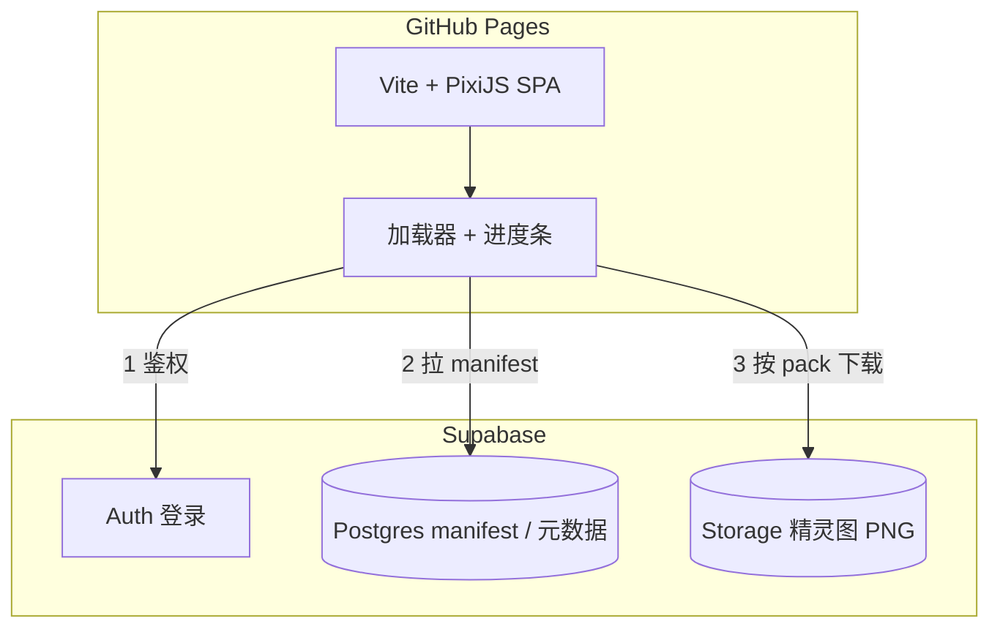
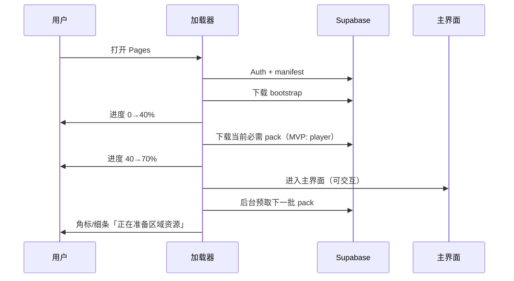

# PixPack 素材工坊 · 项目总览

> **已孵化** — 实现仓库：**[PixPack](https://github.com/jk9988610/PixPack)**（待建）。  
> 本文档为 Talk 构想与交接规格；**不写实现代码**。  
> **Agent 入口**：[PixPack Agent 实现提示词](2026-08-19-PixPack-Agent实现提示词.md)

---

## 问题

个人需要一套**网页端素材工具**：用 PixiJS 预览角色精灵动画（idle / walk 起步），素材通过浏览器上传保存到云端，**不必为每张图手动 git commit**；后期扩展为类似暗黑破坏神 2 的规模（多职业玩家、NPC、按区域出现的敌对单位），加载策略须支持**分类资源包**与**先进再补**（B 方案），避免素材库变大后首屏长时间阻塞。

---

## 方案一句话

**GitHub Pages 托管 SPA（Vite + PixiJS）+ Supabase（Auth / Storage / Postgres）**；素材按 **Pack（资源包）** 组织，启动时拉 manifest，进站显示游戏式加载条，bootstrap 就绪后先进主界面，其余 pack 后台预取；工具模式与游戏模式共用同一套云端素材仓库。

---

## 核心概念速查

| 概念 | 说明 |
|------|------|
| **像素画** | 美术风格（32×32 低分辨率手绘）；不是技术栈 |
| **PixiJS** | 浏览器 2D 渲染库，负责播放精灵帧动画 |
| **Pack** | 逻辑资源包，如 `bootstrap`、`player`、`npc_town`、`enemy_act1` |
| **Manifest** | 清单：有哪些 pack、每个 pack 含哪些文件、版本号、优先级 |
| **Bootstrap** | 启动必下的小包：UI、加载条、manifest |
| **B 方案** | 先进再补：bootstrap + 当前必需 pack 达标即可进主界面，其余后台预取 |

---

## 目标用户与场景

| 项 | 说明 |
|----|------|
| **用户** | 开发者本人（个人工具） |
| **MVP** | 1 个角色、idle + walk；网页上传精灵图；Supabase 保存；进站加载条预览 |
| **后期** | 多职业玩家、城镇 NPC、按 Act/Zone 拆分的敌人；工具按分类懒加载预览；游戏按场景按需加载 |

---

## 架构



| 层 | 选型 | 职责 |
|----|------|------|
| 前端 | Vite + TypeScript + PixiJS v8 | 加载条、预览、上传 UI |
| 托管 | GitHub Pages + Actions | 仅部署静态 SPA |
| 鉴权 | Supabase Auth（Email Magic Link 或 GitHub OAuth） | 仅本人可写 |
| 元数据 | Supabase Postgres | pack、角色、动画 JSON |
| 文件 | Supabase Storage | `spritesheet.png` 等 |

**密钥**：`VITE_SUPABASE_URL`、`VITE_SUPABASE_ANON_KEY` 写入实现仓库 GitHub Secrets，构建时注入；**不得**写入 Talk 正文。

---

## 与普通网页游戏的区别

| 维度 | 典型全静态页游 | PixPack |
|------|----------------|---------|
| 代码 | CDN / 同站 | GitHub Pages |
| 素材 | 常与代码同站 `/assets/` | Supabase Storage URL |
| 改素材 | 重新部署 / commit | 网页上传 → Storage + DB |
| 加载条 | 下同站文件列表 | 先 manifest（DB）→ 再远程 URL |
| 体验 | 100% 后进门 | **B：bootstrap 达标先进，其余预取** |

对用户而言，加载条体验可与页游一致；差异在运维与扩展性。

---

## 资源包（Pack）设计

### 分类（后期）

| category | 示例 pack | 何时加载 |
|----------|-----------|----------|
| `bootstrap` | UI、字体、加载界面 | 每次打开，必下 |
| `player` | 各职业精灵 + 动作 JSON | 选角 / 进游戏前 |
| `npc` | `npc_town` 等 | 进城镇场景 |
| `enemy` | `enemy_act1`、`enemy_act1_dark_wood` | 进对应区域或预取 |
| `vfx` | 共用战斗特效 | 首次战斗前 |

### 拆分原则

1. **逻辑按玩法分**，不按单文件分（避免请求爆炸）。
2. **敌人大类按 Act / Zone 再拆**，禁止单个 `enemy` 巨包。
3. **同 pack 内用精灵图集（spritesheet）** 合并 PNG，减少 HTTP 次数。
4. 每个 pack 有 **`version`** 字段；URL 带 `?v={version}` 便于缓存与增量更新。

### MVP 范围

仅 **1 个 pack**：`player`（含 1 角色、idle + walk）。  
但加载器 API 从第一天设计为 `loadPacks(['bootstrap', 'player'])`，后期传 `['enemy_act1']` 无需改架构。

---

## 加载策略（B 方案：先进再补）



### 进度阶段（建议权重）

| 阶段 | 内容 | 进度区间 |
|------|------|----------|
| 1 | 初始化 PixiJS、Loading UI | 0% → 10% |
| 2 | Supabase 恢复会话 | 10% → 20% |
| 3 | 拉取 manifest / 元数据 | 20% → 30% |
| 4 | 下载 bootstrap pack | 30% → 45% |
| 5 | 下载当前必需 pack | 45% → 70% |
| **门槛** | **≥70% 且必需 pack 就绪 → 进入主界面** | — |
| 6 | 后台预取（不挡操作） | 角标或次级进度 |
| 7 | 进野外/新区域前 | 若未缓存完，短加载条或等待 |

### 进度计算

- 按 **字节权重** 或 **文件数加权**，避免只下 manifest 就显示 100%。
- 失败时显示「加载失败，点击重试」，支持单 pack 重试。

### 缓存（后期增强）

| 层 | 作用 |
|----|------|
| HTTP 缓存 | `?v=version` |
| IndexedDB（P1） | 已下载 pack 本地记录，启动校验 version |
| Service Worker（P2） | 离线、激进缓存 |

---

## 动画与分辨率规范

| 项 | MVP 值 | 说明 |
|----|--------|------|
| 单帧尺寸 | **32×32 px** | 小、清晰、省流量 |
| 网页显示倍率 | **3×** | PixiJS `scale = 3`，约 96px 高 |
| 缩放滤镜 | `nearest` | 像素边缘锐利 |
| idle | 4 帧，4 fps，循环 | 帧索引 0–3 |
| walk | 6 帧，8 fps，循环 | 帧索引 4–9 |
| 精灵图布局 | 单行 10 帧 | 320×32 PNG，透明底 |
| 备选 | 48×48 | 若手绘困难可升，逻辑不变 |

### 输出格式

**推荐：一张 spritesheet.png + 元数据 JSON（存 DB `meta_json`）**

```json
{
  "frameWidth": 32,
  "frameHeight": 32,
  "scale": 3,
  "filter": "nearest",
  "animations": {
    "idle": { "frames": [0, 1, 2, 3], "fps": 4, "loop": true },
    "walk": { "frames": [4, 5, 6, 7, 8, 9], "fps": 8, "loop": true }
  },
  "frames": [
    { "x": 0, "y": 0 },
    { "x": 32, "y": 0 }
  ]
}
```

第一版画图可用 [Piskel](https://www.piskelapp.com/) 导出精灵条，网页负责上传、切帧元数据、预览。

---

## 数据模型（Supabase）

### 表：`asset_packs`

| 字段 | 类型 | 说明 |
|------|------|------|
| `id` | uuid PK | |
| `slug` | text UNIQUE | 如 `player`、`enemy_act1` |
| `name` | text | 显示名 |
| `category` | text | `bootstrap` \| `player` \| `npc` \| `enemy` \| `vfx` \| `ui` |
| `priority` | int | 越小越先下 |
| `version` | int | 改资源时 +1 |
| `zone_id` | text? | 可选，绑定场景 |
| `byte_size` | int? | 用于进度权重 |
| `created_at` | timestamptz | |
| `updated_at` | timestamptz | |

### 表：`pack_assets`

| 字段 | 类型 | 说明 |
|------|------|------|
| `id` | uuid PK | |
| `pack_id` | uuid FK → asset_packs | |
| `kind` | text | `spritesheet` \| `json` \| `audio` |
| `storage_path` | text | Storage 内路径 |
| `public_url` | text | 访问 URL |
| `byte_size` | int | 进度权重 |

### 表：`characters`（MVP 角色实体）

| 字段 | 类型 | 说明 |
|------|------|------|
| `id` | uuid PK | |
| `pack_id` | uuid FK | 所属 pack |
| `name` | text | |
| `role` | text | `player` \| `npc` \| `enemy`（后期） |
| `meta_json` | jsonb | 动画定义（见上） |
| `sheet_asset_id` | uuid FK → pack_assets | 精灵图 |
| `created_at` | timestamptz | |
| `updated_at` | timestamptz | |

### Storage 路径约定

```text
assets/
  packs/{pack_slug}/v{version}/
    spritesheet.png
```

上传新图：Storage 写入 → 更新 `version` → 客户端下次按新 URL 或 query 刷新。

### RLS 要点

- **SELECT**：登录用户可读（或 MVP 公开读 + 仅本人写，实现时二选一并在 README 说明）。
- **INSERT/UPDATE/DELETE**：仅 `auth.uid()` 等于配置的 owner（单人项目可用固定 owner 或首登用户绑定）。

---

## 页面线框

### 加载界面（进站）

```text
┌─────────────────────────────────────┐
│           [Logo] PixPack            │
│                                     │
│     ████████░░░░░░░░  52%           │
│     正在加载玩家资源…                │
│                                     │
│            [ 重试 ]                 │
└─────────────────────────────────────┘
```

### 主界面（MVP）

```text
┌─────────────────────────────────────────────┐
│  PixPack · 素材工坊          [登录] [预取状态]│
├──────────────────┬──────────────────────────┤
│  资源包           │   PixiJS 画布 (棋盘底)    │
│  ▶ player        │      [ 32×32 @ 3x ]       │
│                  │                          │
│  角色: 默认       │   当前: walk  帧 3/6      │
│  动作:           │                          │
│  (•) idle        ├──────────────────────────┤
│  ( ) walk        │  [上传精灵图] [保存]      │
│                  │  帧宽:32  高:32           │
└──────────────────┴──────────────────────────┘
```

后期左侧改为分类树：玩家 / NPC / 敌人 Act1…，点选仅 `loadPacks([slug])` 预览该类。

---

## MVP 功能范围

### 必须（P0）

1. Supabase 项目：Auth、Storage bucket、上表（可 MVP 精简为 `characters` + 内嵌 pack 信息，但 loader API 按 pack 设计）。
2. 进站全屏加载条：bootstrap 逻辑 + 下载 player pack，**≥70% 且必需资源就绪进入主界面**。
3. PixiJS 预览 idle / walk 循环切换。
4. 登录后上传 `spritesheet.png`，填写/自动生成 `meta_json`，保存到 Supabase（**无需用户 commit 素材**）。
5. GitHub Actions 部署 GitHub Pages；Secrets 注入 Supabase 环境变量。
6. 保存成功后可选「热更新纹理」或短提示，不必全屏重载。

### 不做（MVP）

- 网页内像素画笔 / 时间轴编辑器（外部 Piskel 即可）
- 多角色复杂管理 UI（数据结构预留）
- IndexedDB / Service Worker（文档预留 P1）
- 导出 Unity / Godot 格式
- 游戏玩法逻辑（仅素材工具 + 加载器基建）

### 可选 P1

- 后台预取下一 pack 的 UI 角标
- IndexedDB pack 缓存
- 按分类树懒加载预览
- 敌人 Act/Zone pack 模板

---

## 验收标准（MVP）

1. 打开 GitHub Pages URL，出现加载条，随后进入主界面，默认角色 idle 循环播放。
2. 切换 walk，动画正确、无卡顿；`nearest` 缩放清晰。
3. 登录后上传新精灵图并保存，刷新页面后加载条走完仍显示新素材（version 或缓存策略生效）。
4. 未登录不可写入 Storage / DB（RLS 生效）。
5. `docs/SMOKE-TEST.md` 可照做通过。
6. 加载器存在 `loadPacks(slugs: string[])` 接口，MVP 传 `['bootstrap','player']` 即可运行。

---

## 建议实现仓库结构

```text
/
├── src/
│   ├── main.ts
│   ├── app/                 # 主界面
│   ├── loader/              # manifest、进度、预取队列
│   ├── pixi/                # 画布、动画播放
│   ├── supabase/            # 客户端、上传
│   └── ui/                  # 加载条组件
├── public/
├── docs/
│   ├── REFERENCE-SPEC.md    # 从 Talk 同步
│   ├── DATA-MODEL.md
│   └── SMOKE-TEST.md
├── .github/workflows/pages.yml
├── index.html
├── package.json
├── vite.config.ts
├── .env.example
└── README.md
```

---

## 风险与缓解

| 风险 | 缓解 |
|------|------|
| Supabase 不可用 | 加载失败重试；README 记录依赖 |
| RLS 配错 | SMOKE-TEST 含未登录写拒绝用例 |
| 素材变大后首屏慢 | B 方案 + pack 拆分 + 图集 + 缓存 |
| CORS / Storage 权限 | 实现阶段按 Supabase 文档配置 bucket |
| 改网页功能仍需 git push | 仅素材免 commit；README 说明分工 |

---

## 演进路线

```text
MVP     1 角色 · idle/walk · 上传 · 加载条 · pack API 骨架
  ↓
P1      多 pack 分类预览 · 后台预取 UI · IndexedDB
  ↓
P2      多职业 player packs · npc_town
  ↓
P3      enemy 按 act/zone · 区域短加载条 · 游戏引用同一 manifest
```

---

## 关联文档

- [PixPack Agent 实现提示词](2026-08-19-PixPack-Agent实现提示词.md) — 新仓库 Agent 一句话入口
- [Talk AI-GUIDE](../AI-GUIDE.md) — Talk 与实现仓分工

---

## 文档维护

| 版本 | 日期 | 说明 |
|------|------|------|
| v1.0 | 2026-08-19 | 合并 Talk 讨论：Supabase、加载条、Pack、B 方案、MVP 规格 |
